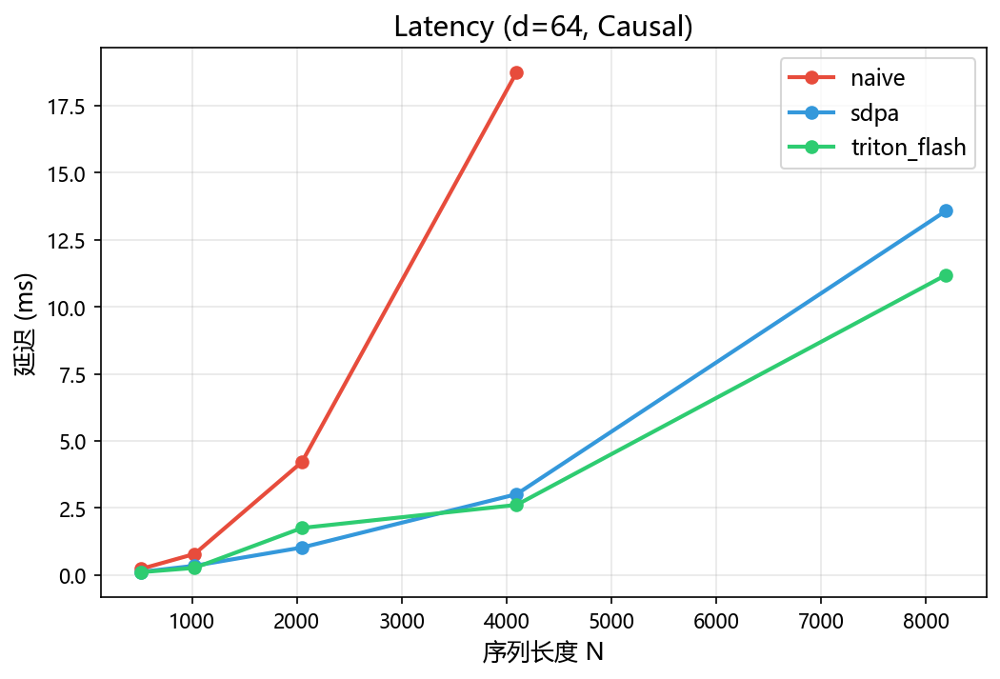
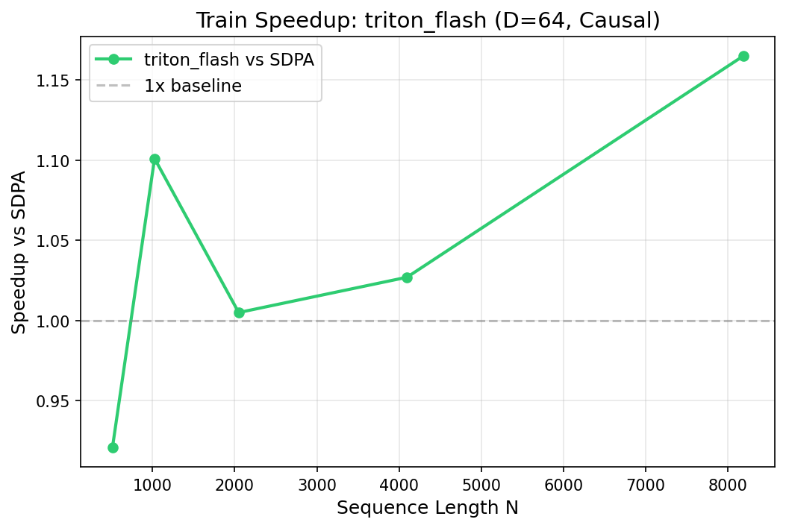
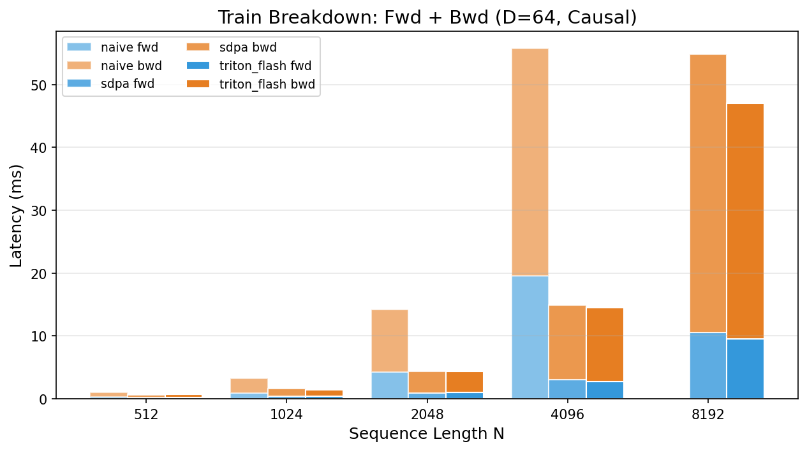
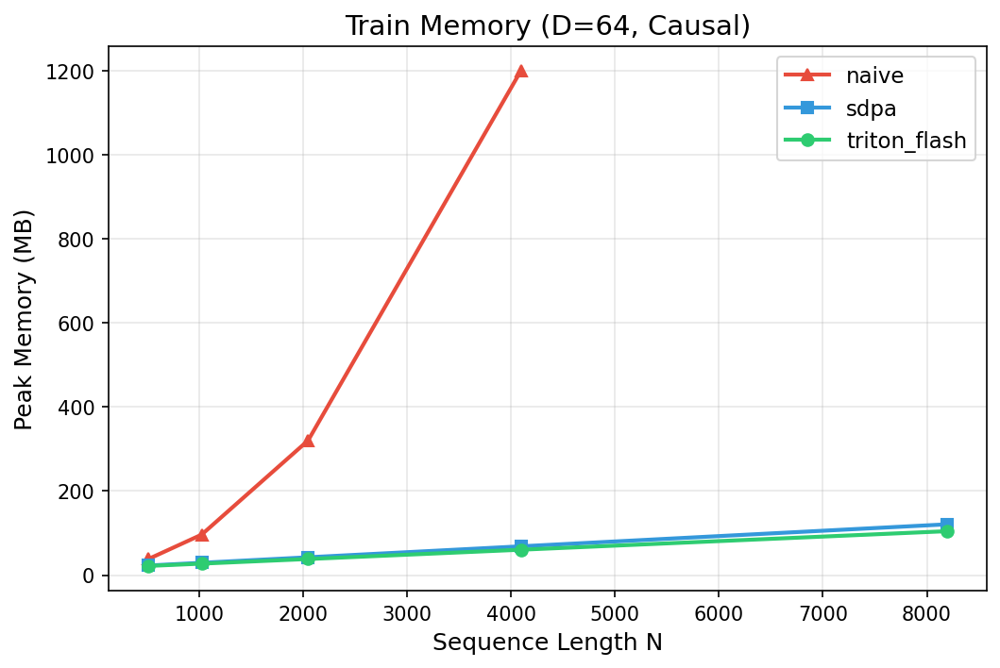

# FlashAttention — Triton 从零实现（Forward + Backward）

使用 Triton 从零实现 FlashAttention，包含 Forward + Backward kernel、Autograd API、完整 Benchmark 与 IO 复杂度验证。

本项目复现 FlashAttention 的核心思想：通过 **IO-aware 计算重排 + Online Softmax**，避免构建 N×N attention 矩阵，从而显著降低显存访问与显存占用。

实现特点：
- 完整 Forward + Backward
- 训练级 API
- 工程化 Benchmark 与 Profiling
- 理论 IO 分析 + 实测验证

---

## 1 项目特性

**IO-aware FlashAttention Kernel**
- Block tiling 计算
- Online Softmax
- 不物化 N×N 注意力矩阵
- IO 复杂度从 O(N²) 降为 O(Nd)

**Mask 支持**
- Causal Mask（自回归模型）
- Padding Mask（变长序列）
- Block Early Exit（跳过完全无效的计算 block）

**训练支持**
- Forward kernel + Backward kernel
- `torch.autograd.Function` 封装
- 可直接用于训练：`Q,K,V → FlashAttention → loss → backward`

**工程化工具链**
- Autotune kernel 参数
- Benchmark suite
- IO complexity analysis
- CUDA profiling（Nsight Compute）

---

## 2 项目结构

```
flashattn-from-scratch/
├── src/
│   ├── kernel/
│   │   ├── flash_attn_triton.py      # 前向 Triton kernel
│   │   └── flash_attn_bwd_triton.py  # 反向 Triton kernel
│   ├── functional.py                  # 上层 API + Autograd
│   ├── reference.py                   # 朴素/SDPA 参考实现
│   └── utils.py                       # 工具函数
├── tests/
│   ├── test_correctness.py            # 前向正确性 + FP32 精度 + Early Exit
│   ├── test_masking.py                # Mask 专项测试
│   └── test_backward.py              # 反向传播正确性 + gradcheck
├── benchmark/
│   ├── run_benchmark.py               # 性能基准 fwd/train 模式
│   ├── plot_results.py                # 图表生成
│   ├── analyze_io.py                  # IO 复杂度验证 + 带宽分析
│   └── results/                       # CSV 数据 + 图表输出
├── profile/
│   └── ncu_notes.md                   # Profiling 笔记
└── README.md
```

---

## 3 环境要求

```
Python >= 3.8
PyTorch >= 2.0 (CUDA)
Triton >= 2.1
pytest
matplotlib
```

安装依赖：

```bash
pip install torch triton pytest matplotlib
```

---

## 4 运行测试

```bash
# 前向测试
python -m pytest tests/test_correctness.py tests/test_masking.py -v

# 反向传播测试
python -m pytest tests/test_backward.py -v

# 全部测试
python -m pytest tests/ -v
```

测试内容包括：
- Forward 数值正确性
- Mask 行为验证
- Backward 梯度正确性
- PyTorch gradcheck

---

## 5 使用示例

### 推理

```python
import torch
from src.functional import flash_attention

B, H, N, d = 2, 8, 2048, 64
Q = torch.randn(B, H, N, d, device="cuda", dtype=torch.float16)
K = torch.randn(B, H, N, d, device="cuda", dtype=torch.float16)
V = torch.randn(B, H, N, d, device="cuda", dtype=torch.float16)

O = flash_attention(Q, K, V)
```

### Causal Attention

```python
O = flash_attention(Q, K, V, causal=True)
```

### Padding Mask

```python
seqlens = torch.tensor([1500, 2048], device="cuda", dtype=torch.int32)
O = flash_attention(Q, K, V, seqlens_k=seqlens)
```

### 训练

```python
Q.requires_grad = True
K.requires_grad = True
V.requires_grad = True

O = flash_attention(Q, K, V, causal=True)
loss = O.sum()
loss.backward()
# Q.grad, K.grad, V.grad 已计算
```

---

## 6 Benchmark

运行 benchmark：

```bash
python benchmark/run_benchmark.py --mode train
```

示例：

```bash
python benchmark/run_benchmark.py \
    --dtype fp16 --causal both \
    --d 64,128 --N 512,1024,2048,4096,8192 \
    --impl sdpa,triton_flash \
    --warmup 10 --repeat 20
```

生成图表：

```bash
python benchmark/plot_results.py
```

---

## 7 Benchmark 结果

> **测试环境**: RTX 4070 Laptop (sm_89) / PyTorch 2.7.1+cu118 / Triton 3.6.0 / FP16 / B=2 H=4

### Forward 延迟

| N | D | Causal | SDPA | Flash | Speedup |
|---:|---:|:------:|-----:|------:|--------:|
| 4096 | 64 | ✗ | 5.29 ms | **4.48 ms** | **1.18x** |
| 4096 | 64 | ✓ | 3.01 ms | **2.61 ms** | **1.15x** |
| 8192 | 64 | ✓ | 13.58 ms | **11.19 ms** | **1.21x** |
| 8192 | 128 | ✗ | 51.62 ms | **38.29 ms** | **1.35x** |
| 8192 | 128 | ✓ | 26.20 ms | **19.51 ms** | **1.34x** |



### 训练 (Forward + Backward)

| N | D | Causal | SDPA total | Flash total | Speedup | Flash 显存 | SDPA 显存 |
|---:|---:|:------:|----------:|----------:|--------:|---------:|--------:|
| 4096 | 64 | ✓ | 14.93 ms | **14.54 ms** | 1.03x | **60 MB** | 69 MB |
| 8192 | 64 | ✗ | 102.20 ms | **89.71 ms** | **1.14x** | **105 MB** | 121 MB |
| 8192 | 64 | ✓ | 54.82 ms | **47.06 ms** | **1.17x** | **105 MB** | 121 MB |





### 显存对比

| N | D | Naive | SDPA | Flash |
|---:|---:|------:|-----:|------:|
| 512 | 64 | 21.6 MB | 10.1 MB | **10.1 MB** |
| 2048 | 64 | 206 MB | 16.1 MB | **16.1 MB** |
| 4096 | 64 | 788 MB | 24.1 MB | **24.1 MB** |
| 4096 | 128 | 800 MB | 40.1 MB | **40.1 MB** |

> Naive → Flash: N=4096 时显存从 **788 MB → 24 MB**，降低 **97%**



### 关键结论

- **Forward**: 长序列 (N≥4096) Triton Flash 稳定超越 SDPA，最高 **1.35x**
- **Train**: N=8192 训练端到端加速 **1.17x**，显存节省 **13%**
- **显存**: IO-aware 策略将显存从 O(N²) 降至 O(Nd)，实测降低 **97%**
- **IO 验证**: 实测 HBM 带宽接近峰值，DRAM bytes 与理论值吻合

---

## 8 Backward 设计

采用**双 kernel 架构**：

| Kernel | 并行轴 | 计算 |
|--------|--------|------|
| Kernel A | k_block | dK + dV |
| Kernel B | q_block | dQ |

- Forward 保存 L = logsumexp
- Backward 使用 P = exp(S - L) 重建 attention 权重
- 这种设计避免 atomic conflict

---

## 9 数值稳定性

| 风险 | 处理 |
|------|------|
| -inf - (-inf) → NaN | alpha = where(m == -inf, 0, exp(m - m_new)) |
| 全 mask 行 | l == 0 时输出/梯度置零 |
| exp 溢出 | 始终减去 L 或当前最大值 |
| fp16 累加误差 | 所有累加使用 fp32 |

---

## 10 后续扩展

- [x] Backward 实现
- [x] 训练级 API
- [ ] Mixed precision kernel
- [ ] KV-cache streaming attention
- [ ] Multi-GPU attention pipeline

---

## 总结

本项目完整实现了：
- FlashAttention Forward
- FlashAttention Backward
- Autograd API
- Benchmark + Profiling
- IO Complexity 验证
